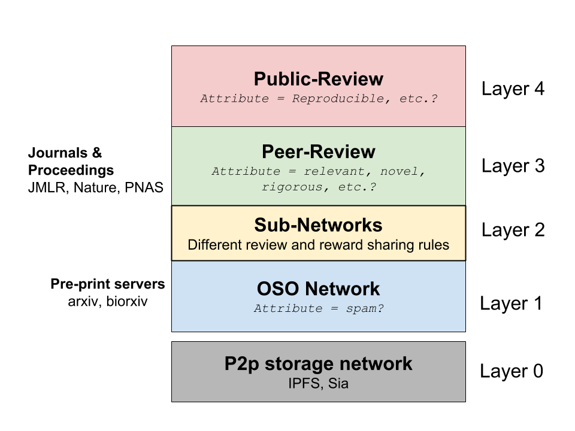

Play with our POC http://www.oso.network/idea-hub/

Read our proposal of creating pay-to-publish platform using Proof of Idea https://github.com/open-science-org/wiki/blob/master/Proof_of_Idea.pdf

# idea-hub

Idea-hub is a decentralized knowledge repository where researchers can **publish and store** scientific publications. This can have a tremendous positive impact for scientific research by allowing researchers to share their ideas rapidly and efficiently, thereby accelerating the scientific research. Since intermediate and incremental steps can also be published, this system inherently encourages reproducibility in scientific research and also provides a way to **formally verify the intellectual contribution** of a researcher.

*This project is closely related to Generalized Idea Protocol (GIP) https://github.com/open-science-org/GIP*

For more information, see Figure 2 in our **Proof of Idea** whitepaper https://github.com/open-science-org/wiki/blob/master/Proof_of_Idea.pdf. The Figure 2 describes our proposed decentralized publishing system based on incentive mechanism supported by Proof of Idea.

## Design Choice #1 : Use IPFS and IPNS
*proposed by Abinash Koirala*

Decentralized file storage and query layers atop IPFS to support human readable queries. Currently, IPFS only allows look-ups for files using its hash generated while storing it in the IPFS network. And here are some of my ideas regarding how to provide a DCMI(or any other format) query layer on top of IPFS:

1. There is IPNS (Interplanetary Name System) which provides a way to link a human readable name with a file stored in IPFS. This would have worked if we were to just support look-ups based on the name of the file which is not the case for us since we are planning to support look-ups based on different attributes in addition to name such as author, published journal/conference, date published, etc. In case of DCMI all the fields listed in http://dublincore.org/documents/2005/06/13/dcmi-terms/ We'll probably use IPNS regardless to get consistent access to different versions of same file but IPNS alone won't be enough to support metadata based queries.

2. We can use a server deployed, highly available metadata store which allows look-ups based on metadata and links to the file in IPFS. This is probably the simplest solution engineering-wise. But server deployed means it defeats the purpose of decentralization. It can be a solution if don't want to be strictly decentralized. Storage will be decentralized regardless. So, thought it was worth mentioning.

3. We can work on our own solution for decentralized metadata store. It can be a fork of IPFS/IPNS or it can be an entirely different network. Which just stores the metadata -> IPFS file-link pair. Technology-wise, this is one hell of a mountain to climb. But it can be a generic metadata store so after this implementing support for multiple metadata formats will be trivial. This can in fact be our pitched product since this is something that doesn't exist as far as I know.

4. We already have different distributed/decentralized object storage projects like storj.io and others which we can use to store our metadata object. We provide publications search api on top of these kinds of projects. I have not delved much into these projects but Storj in particular seems to support some expressive queries.

## Design Choice #2 : Use IPFS (Distributed Metadata storage) and search nodes
*proposed by Sandip Pandey*

Assuming the documents are stored in IPFS, each document will have an IPFS hash. Unless this unique hash is known it is not possible to retrieve the document otherwise. This leads to the necessity for a metadata store which can facilitate a distributed search using humanly-readable queries.

**Metadata structure**

A basic metadata could be represented with tuple consisting of document (IPFS) hash, attribute name and value.

(document_hash, attribute_name, attribute_value)

**Metadata file**

Assuming the metadata for a document vastly remains the same, all the metadata can be grouped inside a metadata file and again use IPFS for storage. The metadata could simply be a json file so that parsing the file at a later stage would be easier.

**Document to Metadata mapping**

With separate document and metadata files, it is now necessary to map them so that we know which metadata belongs with which document. A choice to keep this map is to use DHT which allows update on the mapping incase the metadata file (& hash) changes.

document_hash -> metadata_hash

For this, IPFS-DHT or any other DHT could be used.

**Searcher Nodes**

A searcher node is responsible for handling the search queries and providing appropriate results or next set of nodes who could provide the results. This is basically a DHT node which fetches the metadata from DHT records and indexes them to support search. For indexing and searching, we could use Apache Lucene.

**Incentive to search**

It is important that there should be some incentive mechanism to keep the searcher nodes motivated to store & index more metadata files and respond to search queries. An example could be to have reputation system based on the successful serving of queries. This basically means more results a node serves, higher will be its reputation. In order to successfully serve more queries, a node will need to store & index more documents which in turn maintains the availability of the documents.
